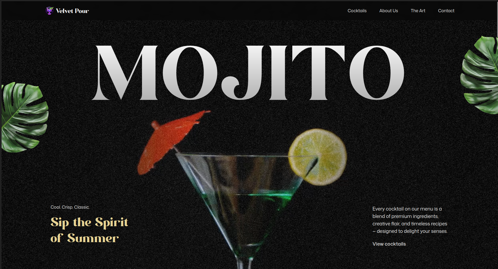
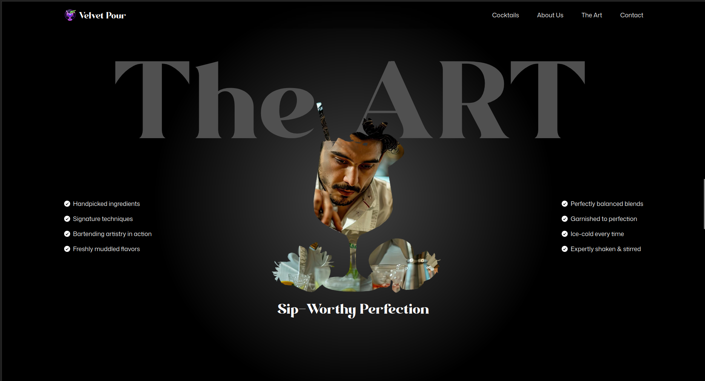
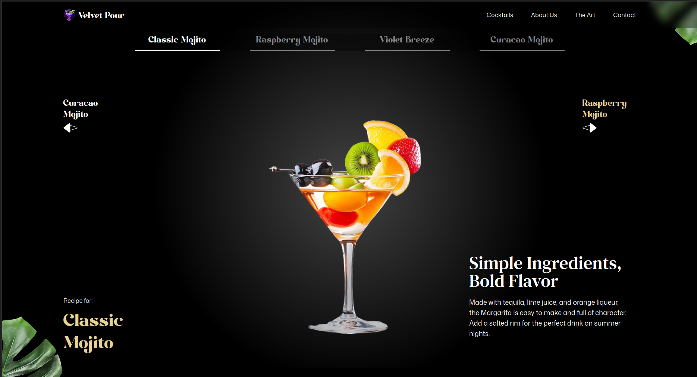

# Mojito Cocktails

A visually stunning and interactive React-based web application designed to showcase cocktails and mocktails, with a focus on the classic Mojito. The site blends beautiful animations, modern UI/UX, and a crisp presentation of cocktail recipes and bar culture.



---

## ✨ Features

- **Immersive Animations:** Leveraging GSAP and SplitText for engaging, scroll-triggered effects and text transitions.
- **Interactive UI:** Responsive layouts and pinning sections ensure a delightful experience on all devices.
- **Cocktail & Mocktail Menu:** Browse a curated list of cocktails and mocktails with details, prices, and country of origin.
- **Artful Visuals:** High-quality images, masked art, and unique visual flourishes throughout.
- **About & Contact:** Informative sections about the bar’s philosophy and ways to connect on social media.
- **Performance:** Built with [Vite](https://vitejs.dev/) for fast refresh and optimized delivery.

---

## 🛠️ Tech Stack

- **React** (with functional components and hooks)
- **Vite** (for rapid development and bundling)
- **GSAP** ([GreenSock Animation Platform](https://greensock.com/gsap/)) + SplitText for advanced animations
- **Tailwind CSS** (with custom utilities and themes)
- **React Responsive** (media queries and device awareness)
- **Modern Negra** and **DM Serif** fonts for elegant typography

---

## 🚀 Getting Started

### Prerequisites

- [Node.js](https://nodejs.org/) (v16+ recommended)
- [npm](https://www.npmjs.com/) or [yarn](https://yarnpkg.com/)

### Installation

```bash
git clone https://github.com/DannyMikeGanzaRwabuhama/mojito-cocktails.git
cd mojito-cocktails
npm install
# or
yarn install
```

### Running Locally

```bash
npm run dev
# or
yarn dev
```

App will start on [http://localhost:5173](http://localhost:5173) (default Vite port).

---

## 📁 Project Structure

```
mojito-cocktails/
├── public/
│   └── assets/        # Images, videos, fonts, etc.
├── src/
│   ├── components/    # Main React components (Hero, About, Art, Menu, Contact, etc.)
│   ├── constants/     # Navigation links, cocktail/mocktail data, feature lists
│   ├── index.css      # Tailwind and custom styles
│   └── App.jsx        # Main app container
├── package.json
└── README.md
```

---

## 🧩 Notable Components

- **Hero:** Animated intro with a looping video and dynamic text.
- **Cocktails/Menu:** Dynamic list of drinks with images and descriptions.
- **About:** The story behind Mojito Cocktails, including customer ratings.
- **Art:** Showcasing the craft of cocktail-making with masked image reveals.
- **Contact:** Social links and opening hours.

---

## 🖼️ Screenshots





---

## 🤝 Contributing

PRs, suggestions, and issue reports are welcome! Please fork the repo and submit a pull request.

---

## 📄 License

*No license specified yet — feel free to reach out for collaboration or usage questions.*

---

## 🌐 Live Demo

- [Link](https://mojito-cocktails-beta.vercel.app/)

---

## 👤 Author

- [DannyMikeGanzaRwabuhama](https://github.com/DannyMikeGanzaRwabuhama)

---

> “Sip the Spirit of Summer” — **Mojito Cocktails**